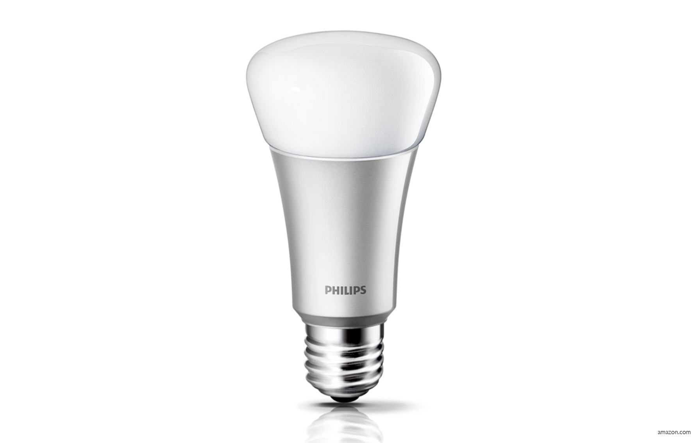
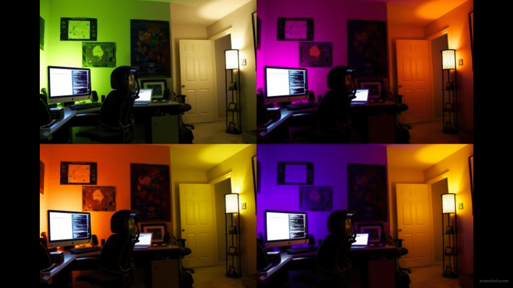
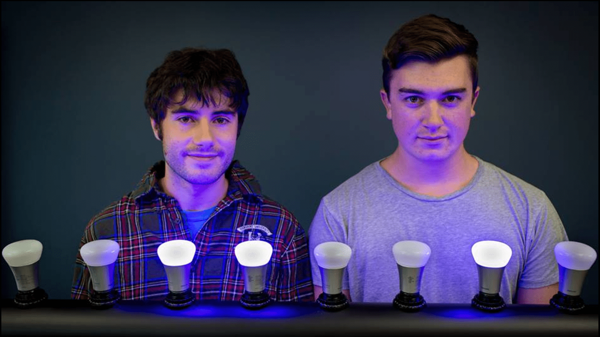
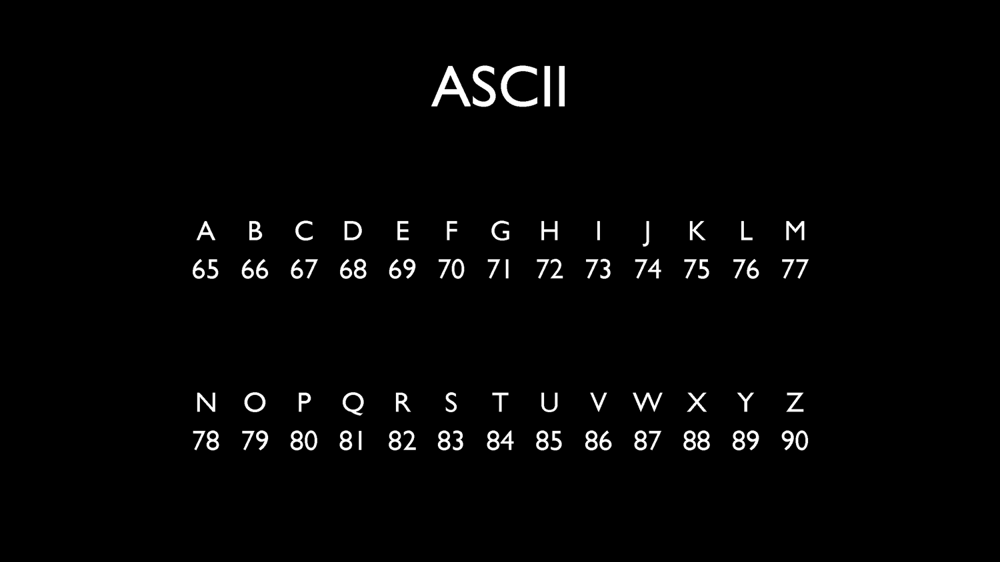

---?color=black
# This is CS.

---?color=black

---?color=black
## Computation
inputs, algorithms, outputs

---?color=black
## inputs,outputs

---?color=black
## binary
0,1

---?color=black
## decimal
0,1,2,3,4,5,6,7,8,9

---?color=black
@snap[middle span-100]
@size[3em](1   2   3)
@snapend

@snap[south span-50 fragment]
@box[bg-black](100x1+10x2+1x3)
@snapend

@snap[south span-50 fragment]
@box[bg-black span-100](100+20+3)
@snapend

@snap[south span-50 fragment]
@box[bg-black span-100](123)
@snapend

---?color=black
@snap[north text-white]
@box[bg-black](4  2  1)
@snapend

@snap[span-50 fragment]
@box[bg-black span-100 midpoint text-30](000)
@box[bg-black span-100 south](0)
@snapend

@snap[span-50 fragment]
@box[bg-black span-100 midpoint text-30](001)
@box[bg-black span-100 south](1)
@snapend

@snap[span-50 fragment]
@box[bg-black span-100 midpoint text-30](010)
@box[bg-black span-100 south](2)
@snapend

@snap[span-50 fragment]
@box[bg-black span-100 midpoint text-30](011)
@box[bg-black span-100 south](3)
@snapend

@snap[span-50 fragment]
@box[bg-black span-100 midpoint text-30](100)
@box[bg-black span-100 south](4)
@snapend

@snap[span-50 fragment]
@box[bg-black span-100 midpoint text-30](101)
@box[bg-black span-100 south](5)
@snapend

@snap[span-50 fragment]
@box[bg-black span-100 midpoint text-30](110)
@box[bg-black span-100 south](6)
@snapend

@snap[span-50 fragment]
@box[bg-black span-100 midpoint text-30](111)
@box[bg-black span-100 south](7)
@snapend

---?color=black

---?color=black

---?color=black

---?color=black

---?color=black

---?color=black
The End.
